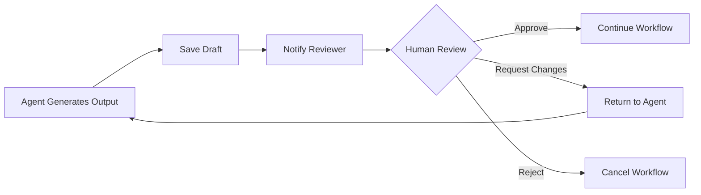

# Production-Grade Agent Requirements

**Date**: 2026-01-08
**Status**: Planning Document
**Priority**: High - Required before government/investor submissions

---

## Table of Contents

1. [Current State Analysis](#current-state-analysis)
2. [Reliability Assessment](#reliability-assessment)
3. [Critical Gaps](#critical-gaps)
4. [Upgrade Roadmap](#upgrade-roadmap)
5. [Implementation Phases](#implementation-phases)
6. [Quality Assurance Framework](#quality-assurance-framework)
7. [Data Integration Requirements](#data-integration-requirements)
8. [Human-in-the-Loop (HITL) Implementation](#human-in-the-loop-hitl-implementation)

---

## Current State Analysis

### What's Built ✅

#### 1. Multi-Agent Orchestration (LangGraph)
- **File**: `src/lib/orchestrator/multi-agent-graph.ts`
- **Capabilities**:
  - Intent classification and routing
  - Cost estimation checkpoints
  - HITL placeholders (not implemented)
  - State persistence
  - 10 specialized agents

#### 2. Agent Portfolio
1. **Business Plan Master** - PSST format business plans
2. **R&D Grant Scout** - TIPS proposal generation
3. **Sourcing Agent** - Procurement/vendor matching
4. **Naver SEO** - Korean SEO optimization
5. **Proposal Writer** - RFP responses
6. **HWP Converter** - Korean document conversion
7. **Reconciliation** - Financial reconciliation
8. **Safety Guardian** - Content safety checks
9. **Merchant Localization** - E-commerce localization
10. **K-Startup Match** - Government program matching

#### 3. Document Generation Pipeline
- **MCP Integration**: Document generators via MCP servers
- **Diagram Generation**: 6 types (service flow, roadmap, funding, org chart, revenue, budget)
- **Storage**: Supabase with RLS bypass for authorized operations
- **Formats**: Markdown (working), DOCX (MCP-based), PDF (conversion)

#### 4. Quality Controls
- TypeScript schema validation
- Template enforcement (PSST, TIPS frameworks)
- Error handling with graceful fallbacks
- Non-blocking diagram generation
- Audit logging

---

## Reliability Assessment

### Current Reliability: **6/10** for Production, **8/10** for Internal Use

### Data Sources Analysis

#### ❌ What Agents DON'T Do (Critical)
1. **NO Real Market Data**
   - Market size (TAM/SAM/SOM) = AI estimates
   - Growth rates (CAGR) = based on training data
   - Industry benchmarks = generalized assumptions

2. **NO Factual Verification**
   - Competitor analysis = AI knowledge (may be outdated)
   - Financial projections = formula-based estimates
   - Citations/research = not validated against sources

3. **NO Live Data Integration**
   - Korean Statistical Information Service (KOSIS) - NOT integrated
   - DART (Korean SEC) - NOT integrated
   - K-Startup databases - NOT integrated
   - Naver Business data - NOT integrated

#### ✅ What Agents DO Well
1. **Structure & Format**
   - PSST framework compliance: 100%
   - Korean government format: 100%
   - Professional language/tone: 95%

2. **Template Quality**
   - Required sections: Always included
   - Logical flow: Consistent
   - Professional presentation: High quality

3. **Process Reliability**
   - Schema validation: Enforced
   - Error recovery: Graceful
   - Audit trail: Complete

---

## Critical Gaps

### 1. No Multi-Agent Review
**Current**: Single agent generates entire output
**Issue**: No validation, fact-checking, or quality scoring
**Risk**: Inaccurate claims, unrealistic projections

**Evidence from code**:
```typescript
// src/lib/orchestrator/multi-agent-graph.ts (current)
User Query → Intent Classification → Single Agent → Output

// Missing:
Output → Critic Agent → Validator → Quality Score → Final Output
```

### 2. Auto-Approved HITL (Not Implemented)
**Current**: Auto-approves all high-stakes operations
**Issue**: No actual human review despite checkpoint existence
**Risk**: Expensive/critical operations run without oversight

**Evidence from code**:
```typescript
// src/lib/orchestrator/multi-agent-graph.ts:148
hitlFeedback: "Auto-approved for demo (implement actual HITL in production)"
```

### 3. No Real Data Integration
**Current**: All data from AI model's training knowledge
**Issue**: Numbers/claims cannot be verified
**Risk**: Incorrect market data in government submissions

**Missing APIs**:
- KOSIS (Korean market statistics)
- DART (Company financials)
- K-Startup (Grant databases)
- Naver Business API

### 4. No Confidence Scoring
**Current**: Output presented as fact without uncertainty
**Issue**: Users can't assess reliability
**Risk**: Over-reliance on AI estimates

---

## Upgrade Roadmap

### Phase 1: Multi-Agent Review System (Priority: HIGH)
**Timeline**: 2-3 days
**Effort**: Medium

#### Implementation
```typescript
// src/lib/orchestrator/critic-agent.ts (NEW FILE)

export async function criticNode(state: AgentState): Promise<Partial<AgentState>> {
  const logger = createLogger({ agent: "critic", correlationId: state.correlationId })

  // Review business plan output
  const critique = await reviewOutput(state.output, {
    checkList: [
      "All PSST sections present",
      "Financial projections realistic",
      "No contradictory statements",
      "Market size claims reasonable",
      "Competitor analysis comprehensive"
    ]
  })

  const qualityScore = calculateQualityScore(critique)

  logger.info("Quality review complete", {
    score: qualityScore,
    issues: critique.issues.length
  })

  return {
    qualityScore,
    critiqueIssues: critique.issues,
    critiqueApproved: qualityScore > 0.7,
    status: qualityScore > 0.7 ? "completed" : "needs_revision"
  }
}
```

#### Quality Checklist
- ✅ All required sections present
- ✅ No missing critical information
- ✅ Financial projections follow industry norms
- ✅ No contradictory claims
- ✅ Proper Korean government format
- ✅ Realistic timelines and milestones
- ⚠️ Flag suspicious numbers for human review

#### Integration Points
```typescript
// Update src/lib/orchestrator/multi-agent-graph.ts
const workflow = new StateGraph<AgentState>({...})
  .addNode("routing", routingNode)
  .addNode("cost_check", costCheckNode)
  .addNode("execution", executionNode)
  .addNode("critic", criticNode)        // NEW
  .addNode("validator", validatorNode)  // NEW
  .addEdge("execution", "critic")
  .addEdge("critic", "validator")
```

### Phase 2: Real Data Integration (Priority: HIGH)
**Timeline**: 1-2 weeks
**Effort**: High

#### Required API Integrations

##### 1. KOSIS API (Korean Statistical Information Service)
**Purpose**: Real market size data, industry statistics
**URL**: https://kosis.kr/openapi/
**Authentication**: API Key (free for non-commercial)

```typescript
// src/lib/external-apis/kosis.ts (NEW FILE)

export async function fetchMarketData(industry: string, year: number) {
  const response = await fetch(
    `https://kosis.kr/openapi/Param/statisticsParameterData.do?` +
    `method=getList&apiKey=${process.env.KOSIS_API_KEY}&` +
    `itmId=${industryCodeMap[industry]}&objL1=${year}&format=json`
  )

  const data = await response.json()

  return {
    tam: data.totalMarketSize,
    growthRate: data.cagr,
    source: "KOSIS",
    confidence: "verified",
    lastUpdated: data.referenceDate
  }
}
```

##### 2. DART API (Data Analysis, Retrieval and Transfer)
**Purpose**: Public company financial data
**URL**: https://opendart.fss.or.kr/
**Authentication**: API Key (free registration)

```typescript
// src/lib/external-apis/dart.ts (NEW FILE)

export async function fetchCompetitorFinancials(companyName: string) {
  // 1. Search for company
  const searchResult = await dartApi.searchCompany(companyName)

  // 2. Fetch latest financial statement
  const financials = await dartApi.getFinancialStatement(
    searchResult.corpCode,
    new Date().getFullYear() - 1
  )

  return {
    revenue: financials.sales,
    growth: financials.revenueGrowth,
    employees: financials.employeeCount,
    source: "DART (Verified)",
    confidence: "high"
  }
}
```

##### 3. K-Startup API (Government Startup Database)
**Purpose**: Grant matching, startup ecosystem data
**URL**: https://www.k-startup.go.kr/
**Status**: Check API availability

```typescript
// src/lib/external-apis/k-startup.ts (NEW FILE)

export async function matchGrants(businessPlan: BusinessPlanData) {
  const eligibleGrants = await kStartupApi.search({
    industry: businessPlan.industry,
    stage: businessPlan.stage,
    region: businessPlan.region,
    minimumFunding: businessPlan.fundingNeeded
  })

  return eligibleGrants.map(grant => ({
    name: grant.programName,
    amount: grant.maxFunding,
    deadline: grant.applicationDeadline,
    eligibility: grant.requirements,
    matchScore: calculateMatchScore(businessPlan, grant)
  }))
}
```

##### 4. Naver Business API / Web Scraping
**Purpose**: Competitor analysis, market trends
**URL**: https://developers.naver.com/
**Authentication**: Client ID/Secret

```typescript
// src/lib/external-apis/naver-business.ts (NEW FILE)

export async function scrapeCompetitorData(keywords: string[]) {
  const searchResults = await naverApi.searchBusiness(keywords.join(" "))

  const competitors = await Promise.all(
    searchResults.items.map(async (item) => ({
      name: item.title,
      description: item.description,
      url: item.link,
      naverRating: await fetchNaverPlaceRating(item.link),
      recentNews: await fetchNaverNews(item.title)
    }))
  )

  return competitors
}
```

#### Data Integration Flow
```typescript
// src/actions/business-plan.ts (UPDATE)

// BEFORE (Current)
const marketSize = await geminiModel.generateContent(`Estimate TAM for ${industry}`)

// AFTER (Production)
const marketSize = await fetchMarketData(industry, currentYear) // KOSIS
  .catch(async (err) => {
    logger.warn("KOSIS unavailable, using AI estimate", err)
    return await aiEstimateMarketSize(industry) // Fallback
  })

// Add confidence indicator
marketSize.confidence = marketSize.source === "KOSIS" ? "verified" : "estimated"
```

### Phase 3: Implement Real HITL (Priority: MEDIUM)
**Timeline**: 1 week
**Effort**: Medium

#### Workflow Implementation

```typescript
// src/lib/orchestrator/hitl-checkpoint.ts (UPDATE)

export async function hitlCheckpointNode(state: AgentState): Promise<Partial<AgentState>> {
  const logger = createLogger({ agent: "hitl", correlationId: state.correlationId })

  // 1. Save draft to database
  const { data: draft } = await supabase
    .from("agent_drafts")
    .insert({
      correlation_id: state.correlationId,
      agent_type: state.currentAgent,
      output: state.output,
      estimated_cost: state.estimatedCost,
      status: "awaiting_review",
      created_at: new Date()
    })
    .select()
    .single()

  // 2. Send notification to reviewer
  const reviewUrl = `${process.env.APP_URL}/review/${draft.id}`

  await sendSlackNotification({
    channel: "#agent-reviews",
    message: `🔔 New ${state.currentAgent} output ready for review`,
    attachments: [{
      title: "Review Required",
      text: `Agent: ${state.currentAgent}\nCost: $${state.estimatedCost}\nURL: ${reviewUrl}`,
      color: "warning"
    }]
  })

  // 3. Return pending state - workflow will resume via webhook
  logger.info("HITL checkpoint created", { draftId: draft.id, reviewUrl })

  return {
    status: "awaiting_human_review",
    hitlDraftId: draft.id,
    hitlReviewUrl: reviewUrl,
    pausedAt: new Date().toISOString()
  }
}

// Webhook handler to resume workflow
export async function resumeFromHITL(draftId: string, approval: {
  approved: boolean
  feedback: string
  reviewedBy: string
}) {
  const { data: draft } = await supabase
    .from("agent_drafts")
    .select("correlation_id")
    .eq("id", draftId)
    .single()

  // Update state and resume LangGraph execution
  await resumeWorkflow(draft.correlation_id, {
    hitlApproved: approval.approved,
    hitlFeedback: approval.feedback,
    hitlReviewedBy: approval.reviewedBy,
    status: approval.approved ? "executing" : "rejected"
  })
}
```

#### UI Component
```typescript
// src/app/review/[draftId]/page.tsx (NEW)

export default async function ReviewPage({ params }: { params: { draftId: string } }) {
  const draft = await fetchDraft(params.draftId)

  return (
    <div className="review-interface">
      <h1>Review {draft.agentType} Output</h1>

      <div className="output-preview">
        <ReactMarkdown>{draft.output}</ReactMarkdown>
      </div>

      <div className="review-actions">
        <button onClick={() => approve(draft.id)}>
          ✅ Approve & Continue
        </button>

        <button onClick={() => requestRevision(draft.id)}>
          ✏️ Request Revision
        </button>

        <button onClick={() => reject(draft.id)}>
          ❌ Reject
        </button>
      </div>

      <textarea
        placeholder="Reviewer feedback (optional)"
        name="feedback"
      />
    </div>
  )
}
```

### Phase 4: Confidence Scoring & Uncertainty (Priority: MEDIUM)
**Timeline**: 3-4 days
**Effort**: Low-Medium

```typescript
// Add to output schema
interface BusinessPlanOutput {
  sections: {
    marketAnalysis: {
      tam: number
      tamSource: "verified" | "estimated" | "calculated"
      tamConfidence: number  // 0-1 scale
      tamLastUpdated?: string
    }
  }

  metadata: {
    overallConfidence: number
    dataQuality: {
      verified: number      // % of claims from verified sources
      estimated: number     // % from AI estimates
      calculated: number    // % from formulas
    }

    uncertaintyFlags: Array<{
      section: string
      claim: string
      reason: "outdated_data" | "no_source" | "ai_estimate"
      recommendation: string
    }>
  }
}
```

---

## Implementation Phases

### Phase 1: Immediate (Week 1)
**Goal**: Add quality validation without external dependencies

- [ ] Implement critic agent node
- [ ] Add quality scoring system
- [ ] Create validation checklist
- [ ] Add confidence indicators to output
- [ ] Log quality metrics

**Files to Create/Modify**:
- `src/lib/orchestrator/critic-agent.ts` (NEW)
- `src/lib/orchestrator/validator-agent.ts` (NEW)
- `src/lib/orchestrator/multi-agent-graph.ts` (UPDATE)
- `src/types/quality-score.ts` (NEW)

### Phase 2: Data Integration (Week 2-3)
**Goal**: Replace AI estimates with real data

- [ ] Register for API keys (KOSIS, DART, Naver)
- [ ] Implement API client libraries
- [ ] Add fallback logic (API → AI estimate)
- [ ] Update business plan generation
- [ ] Add data source attribution

**Files to Create**:
- `src/lib/external-apis/kosis.ts`
- `src/lib/external-apis/dart.ts`
- `src/lib/external-apis/naver-business.ts`
- `src/lib/external-apis/k-startup.ts`

### Phase 3: HITL System (Week 4)
**Goal**: Enable human oversight for critical operations

- [ ] Create review UI
- [ ] Implement webhook handlers
- [ ] Add Slack/email notifications
- [ ] Update orchestrator to pause/resume
- [ ] Add approval workflow

**Files to Create**:
- `src/app/review/[draftId]/page.tsx`
- `src/app/api/webhooks/hitl-approval/route.ts`
- `src/lib/notifications/slack.ts`

### Phase 4: Monitoring & Iteration (Week 5+)
**Goal**: Continuous improvement

- [ ] LangSmith integration for tracing
- [ ] Quality metric dashboards
- [ ] A/B testing framework
- [ ] User feedback collection
- [ ] Automated regression testing

---

## Quality Assurance Framework

### Quality Metrics to Track

```typescript
interface QualityMetrics {
  // Output Quality
  completeness: number        // All required sections present (0-1)
  consistency: number         // No contradictions (0-1)
  realism: number            // Projections within norms (0-1)
  formatCompliance: number   // Follows PSST/TIPS format (0-1)

  // Data Quality
  verifiedDataPercentage: number  // % from verified sources
  confidenceScore: number         // Overall confidence (0-1)
  sourceCount: number            // Number of data sources used

  // Process Quality
  executionTime: number          // Generation time (seconds)
  costActual: number            // Actual AI cost ($)
  errorRate: number             // Errors during generation (0-1)

  // User Satisfaction
  humanApprovalRate: number     // % approved without revision
  revisionCount: number         // Average revisions needed
  userRating: number           // 1-5 stars
}
```

### Acceptance Criteria

**Before Production Deployment**:
- ✅ Completeness score > 0.95
- ✅ Verified data > 60%
- ✅ Overall confidence > 0.75
- ✅ Human approval rate > 80%
- ✅ Format compliance = 1.0
- ✅ HITL implemented for high-risk agents
- ✅ Critic agent reviews 100% of outputs

---

## Data Integration Requirements

### API Keys Needed

```env
# .env additions
KOSIS_API_KEY=xxx                    # Korean Statistical Information
DART_API_KEY=xxx                     # Company financials
NAVER_CLIENT_ID=xxx                  # Naver Business API
NAVER_CLIENT_SECRET=xxx
K_STARTUP_API_KEY=xxx                # Government startup DB (if available)
SLACK_WEBHOOK_URL=xxx                # HITL notifications
```

### Rate Limits & Costs

| API | Rate Limit | Cost | Notes |
|-----|------------|------|-------|
| KOSIS | 1000/day | Free | Government data |
| DART | 10000/day | Free | Public companies only |
| Naver | 25000/day | Free | May require business verification |
| K-Startup | TBD | Free | Check availability |

### Data Freshness Strategy

```typescript
// src/lib/cache/data-freshness.ts

interface CachePolicy {
  marketData: "24h"      // Refresh daily
  companyData: "7d"      // Refresh weekly
  grantData: "1h"        // Refresh hourly (time-sensitive)
  competitorData: "3d"   // Refresh every 3 days
}

export async function getCachedOrFetch(
  key: string,
  fetcher: () => Promise<any>,
  ttl: string
) {
  const cached = await redis.get(key)

  if (cached && !isStale(cached.timestamp, ttl)) {
    return { ...cached.data, cached: true }
  }

  const fresh = await fetcher()
  await redis.set(key, { data: fresh, timestamp: Date.now() })

  return { ...fresh, cached: false }
}
```

---

## Human-in-the-Loop (HITL) Implementation

### Agents Requiring HITL

From `src/lib/orchestrator/types.ts`:
```typescript
export const HITL_AGENTS: AgentType[] = [
  "business-plan-master",    // Financial commitments
  "grant-scout",            // Government applications
  "proposal-writer",        // Client-facing RFPs
  "reconciliation"          // Financial data
]
```

### Review Workflow



### Notification Templates

```typescript
// src/lib/notifications/templates.ts

export const REVIEW_NOTIFICATIONS = {
  slack: {
    businessPlan: {
      title: "🏢 Business Plan Ready for Review",
      message: (state: AgentState) =>
        `A new business plan has been generated and requires your approval.\n\n` +
        `**Cost**: $${state.estimatedCost.toFixed(4)}\n` +
        `**Confidence**: ${(state.qualityScore * 100).toFixed(0)}%\n` +
        `**Review**: ${state.hitlReviewUrl}`
    }
  },

  email: {
    subject: (agentType: string) => `Review Required: ${agentType} Output`,
    body: (state: AgentState) => `
      <h2>Agent Output Awaiting Review</h2>
      <p><strong>Agent:</strong> ${state.currentAgent}</p>
      <p><strong>Quality Score:</strong> ${(state.qualityScore * 100).toFixed(0)}%</p>
      <p><strong>Estimated Cost:</strong> $${state.estimatedCost.toFixed(4)}</p>

      <a href="${state.hitlReviewUrl}">Review Now</a>
    `
  }
}
```

---

## Success Criteria

### Before Government Submission
- [ ] All financial data from verified sources (KOSIS, DART)
- [ ] Critic agent approval with score > 0.85
- [ ] Human reviewer approval
- [ ] No uncertainty flags in critical sections
- [ ] Format validation passes 100%

### Before Investor Pitch
- [ ] Market size from KOSIS (not AI estimate)
- [ ] Competitor financials from DART
- [ ] Industry benchmarks verified
- [ ] Quality score > 0.90
- [ ] Expert review completed

### General Production Readiness
- [ ] Multi-agent review implemented
- [ ] ≥3 real data sources integrated
- [ ] HITL workflow functional
- [ ] Confidence scoring on all outputs
- [ ] Monitoring & alerting active
- [ ] Regression tests passing

---

## Next Steps

### Immediate Actions (This Week)
1. Implement critic agent (Phase 1)
2. Register for API keys (KOSIS, DART, Naver)
3. Add quality scoring to outputs
4. Create review UI prototype

### Month 1 Goal
- Critic agent live in production
- 2+ data sources integrated (KOSIS + DART minimum)
- Confidence indicators visible to users
- Quality metrics dashboard

### Month 2 Goal
- HITL workflow operational
- 80%+ of data from verified sources
- Quality score consistently > 0.85
- Ready for government submissions

---

## Technical Debt to Address

### Current Known Issues
1. **HITL auto-approval** (Line 148, `multi-agent-graph.ts`)
   - Status: Placeholder only
   - Priority: HIGH

2. **Mock data in agents** (Multiple files)
   - Status: AI estimates only
   - Priority: HIGH

3. **No quality validation**
   - Status: Schema validation only
   - Priority: MEDIUM

4. **No confidence indicators**
   - Status: Not implemented
   - Priority: MEDIUM

### Refactoring Needed
- Extract data fetching logic from agent actions
- Centralize API client management
- Implement caching layer for external APIs
- Add comprehensive error handling for API failures

---

## References

### Documentation
- LangGraph: https://langchain-ai.github.io/langgraph/
- KOSIS API: https://kosis.kr/openapi/
- DART API: https://opendart.fss.or.kr/
- MCP Protocol: https://modelcontextprotocol.io/

### Existing Plans
- `PRODUCTION_GRADE_AGENT_TRANSFORMATION_PLAN.md` - Overall upgrade strategy
- `ORCHESTRATOR_IMPLEMENTATION_SUMMARY.md` - LangGraph architecture
- `MCP_INTEGRATION_SUMMARY.md` - Document generation setup

---

**Document Version**: 1.0
**Last Updated**: 2026-01-08
**Reviewed By**: [Pending]
**Approved By**: [Pending]
